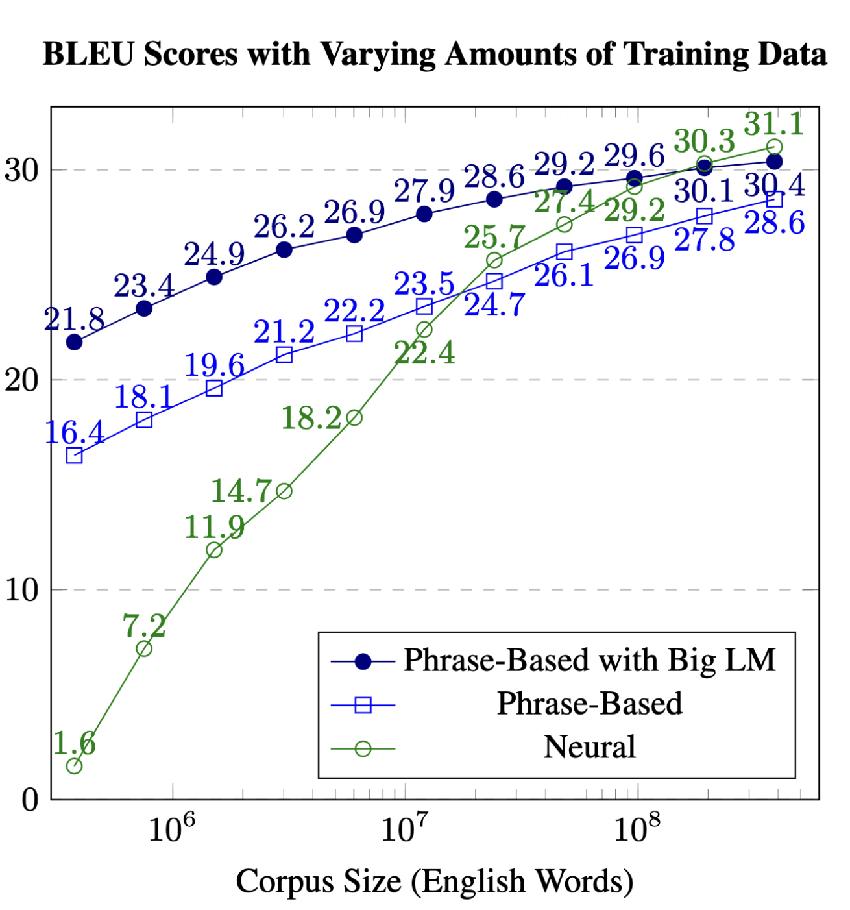

= NMT Learning Curve 
:xrefstyle: short

Re-iteration of the famous learning curve experiment from https://aclanthology.org/W17-3204/[Koehn and Knowles (2017)]

[#fig-curve-old]

== Aim
Neural/deeplearning models are known to have poorer formance in lesser training data scenarios, which is demonstrated in <<fig-curve-old>>. 
In this work, new neural MT approaches such as Transformers are compared with the non-neural and other predecessors to see how much improvements has been made.

== Setup

Train NMT models at different training corpus size, and track its peformance on a test set (BLEU). 
Use the same data sets and splits as https://aclanthology.org/W17-3204/[Koehn and Knowles (2017)], as well as compare the results with their  

[#fig-curve-new]
image::nmt-learning-curve.png[width=480px,title="NMT learning curve revisited"]

== Summary:

* Transformer NMT requires lesser training data than RNN NMT used by Koehn and Knowles (2017). See Transformer base in the <<fig-curve-new>>. 
* The Transformer base is already consistently higher than prior neural model, it can be further improved by tuning a few hyperparameters such as batch size and vocabualary size (Transformer varbatch in <<fig-curve-new>>)

== Take Aways

* Neural models are parameteric models. Parametric models needs its hyperparameters to be carefully chosen
* To achieve good performance in low-resource / less training data scenarios, hyperparameter values needs to be carefully set
