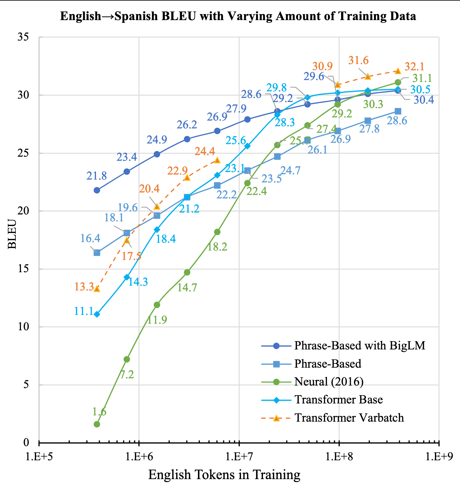

= NMT Learning Curve 

Re-iteration of the famous learning curve experiment from https://aclanthology.org/W17-3204/[Koehn and Knowles (2017)]

== Setup / Goal
Train NMT models at different training corpus size, and track its peformance on a test set (BLEU).
Neural/deeplearning models are known to have poor formance in lesser training data scenarios.  
So one of the goals is to see the new neural MT approache, e.g. Transformer, compare with the non-neural and other predecessors.

== Summary:

* Transformer NMT requires lesser training data than RNN NMT used by Koehn and Knowles (2017). See Transformer base in the figure. 
* The Transformer base is already consistently higher than prior neural model, it can be further improved by tuning a few hyperparameters such as batch size and vocabualary size (Transformer varbatch in the figure)

== Take Aways

* Neural models are parameteric models. Parametric models needs its hyperparameters to be carefully chosen
* To achieve good performance in low-resource / less training data scenarios, hyperparameter values needs to be carefully set
